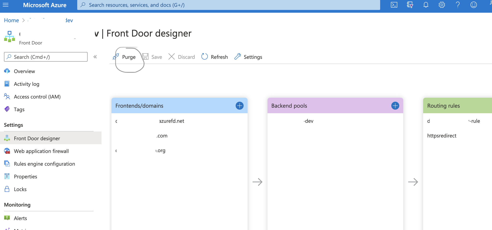

# Purging Azure FrontDoor CDN With AzDevops

When Azure Frontdoor with CDN is used to deliver content, you may need to purge your endpoint so that changes you make are sent to your users, as files are cached in the Azure CDN until their time-to-live (TTL) expires. If you don’t set a TTL for your files, Azure automatically sets a TTL of 7 days. Even if you set a lower TTL, your updates may not coincide with the cache expiration.

Azure Front Door has the same list of POP (Point of Presence) locations as Azure CDN from Microsoft. 
[Here is Azure CDN POP locations from Microsoft](https://docs.microsoft.com/en-us/azure/cdn/cdn-pop-locations)

## Purge Azure Frontdoor CDN from Azure Portal



## Purge Azure Frontdoor CDN from commandline

Note: The Front end host name of frontdoor is as https://mymap.azurefd.net , the --name parameter does not use the FQDN and uses just the myapp as below:

```shell
az extension add --name front-door
az network front-door purge-endpoint --resource-group myrg --name mymap --content-paths "/"
```

## Programmatically Purging Azure Frontdoor CDN With AzDevops

 1. Create a Azure Service Connection by creating a service principal so that devops process has access to perform pruging operation on frontdoor resource
    1. Create a App Registration -> as spn-devops-dev
    2. Goto Certificates and Secrets -> Add secret , note the ApplicationId and Secret
    3. Goto Frontdoor instance -> open Access Control (IAM) -> Add Role Assignment -> Role as "Contributor" -> Assign Access To-> "user, groups or service principal" -> Select -> search for service principal spn-devops-dev -> Select
    4. Note the Azure Service Connection name - as mymap-dev-service-connection
 2. Add environment variables for Azure FrontDoor, ResourceGroup and Service Connection
 3. Add a purging step which depends on the successly deploy. This ensure the cdn cache is refreshed with newer contents from the build after every build.

```yaml
 trigger:
  branches:
    include:
      - develop

pool: mymap-agent-pool-01

variables:
  - group: viz-variables-develop

schedules:
  - cron: "0 0 * * *"
    displayName: Daily midnight build - develop
    branches:
      include:
        - develop
    always: true

stages:
  - stage: package_build
    jobs:
      - template: azure-pipelines/templates/build-template.yml
        parameters:
          map_subscription_key: $(NEXT_PUBLIC_AZURE_MAP_SUBSCRIPTION_KEY)
          appinsights_instrumentation_key: $(NEXT_PUBLIC_APPINSIGHTS_INSTRUMENTATIONKEY)
          build_id: $(Build.BuildId)

  - stage: deploy
    dependsOn: package_build
    jobs:
      - template: azure-pipelines/templates/deploy-template.yml
        parameters:
          app_name: "mymap-dev"
          azure_service_connection: 'mymap-dev - Azure-PublishProfile'

  - stage: purge
    dependsOn: deploy
    jobs:
       - template: azure-pipelines/templates/purge-template.yml
         parameters:
           front_door: $(AZURE_FRONTDOOR)
           resource_group: $(AZURE_RESOURCE_GROUP)
           azure_service_connection: 'mymap-dev-service-connection'

```

purge-template.yml

```yaml
jobs:
- job: purge
  pool:
    vmImage: ubuntu-16.04
  steps:
  - task: AzureCLI@2
    inputs:
      azureSubscription: ${{ parameters.azure_service_connection }}
      scriptType: 'bash'
      scriptLocation: 'inlineScript'
      inlineScript: |
        az extension add --name front-door
        az network front-door purge-endpoint --resource-group ${{ parameters.resource_group}} --name ${{ parameters.front_door}} --content-paths "/"
```

## Benefit of using FrontDoor with CDN

Content Delivery Networks (CDNs) accelerate web traffic across the internet through servers residing in strategic locations (known as points of presence or PoPs) across the globe. Each PoP has a number of caching servers, each of which contains a cached version of your website or application. By bringing content closer to each visitor, CDNs improve performance and reduce load on the origin server.
