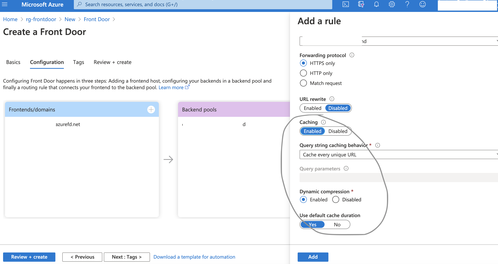
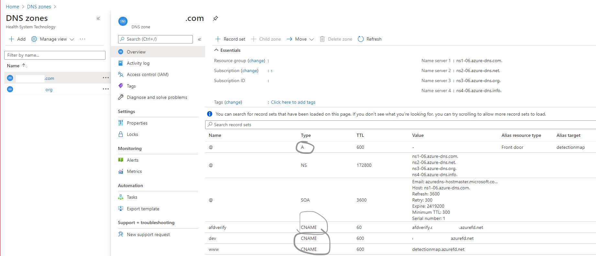

# Get Started with Azure Frontdoor

## What is Azure Frontdoor

This is a Application Delivery Networking service that acts as a load balancer and an application firewall.
Overview [https://docs.microsoft.com/en-us/azure/frontdoor/front-door-overview]

## Why is it chosen as Application Delivery Network

* Highly performant. Routes users to the most performant application. Based on the end user location if the user is in West US and the Web App in West US is the most performant as it is the closest to the user and has the lowest latency.
* High availability. Ensure users get routed to a working application (so fail over to a working endpoint when one fails)
* Highly secure : WAF policies to protect applications against DDoS attacks
* CDN capability on one click. Caching services on Azure Front Door caching are optimized for hosting static content and most CDN services are globally distributed.
* Traffic filtering based on geolocation, IP Addresses , IP Address Ranges.
* Rewrite URLs
* Azure Front Door was chosen against Azure CDN as WAF policies in CDN were in public preview and not in GA.
* Azure Front Door was chosen against Azure App Gateway as AFD is most performant.

## How to Setup a secured ,scalable and performance Front Door

* Step 1 : Create Web App ,this can be in different regions.
* Step 2 : Setup Global WAF for Azure Frontdoor
* Step 3 : Create a new Azure Front Door instance and add a custom domain to Front Door

### Step 1 : Create a WebApp

Web App is created and updated thru a CI/CD process as shown in the image

### Step 2 : Create a Global WAF for Azure Frontdoor

#### Create a Global WAF for FrontDoor

#### Add Policy Settings to handle 403 errors

#### Set the Managed Rules to default rules to prevent web application from common threats

#### Add Custom rules to prevent access to non permissible IP Address or IP Address Ranges

### Create a Azure Frontdoor Service Instance

#### Create front door service

Add a front end as below , make sure the global frontdoor waf that was setup in previous step is selected

#### Add a backend, a backend host type type of App Service is selected. Then set Health Probes and Load Balancers settings as below

#### Add a routing rules as below and ensure Caching behavior is set to Cache every unique URL

#### Add a custom domain as below

* Customer may have 1 or more domains, let's take an example that customer has 2 domains .com and .org
* myapp.com / myapp.org are public domains which need to be mapped to this frontdoor end point.
* There is a certificate which has been bought and this is stored in the keyvault.

Overview on how to add a custom domain [https://docs.microsoft.com/en-us/azure/frontdoor/front-door-custom-domain]

#### Create a "CNAME" DNS record endpoints and associate the custom domain with your Front Door

Separate entries for endpoints with and without www are needed for both .com and .org domains as in picture below.

myapp-dev.com
www.myapp-dev.com
myapp-dev.org
www.myapp-dev.org

#### Create a "A" (Alias) DNS record for naked myapp.com

* Ensure certificates are picked from keyvault setup

* Post certificate provisioning custom domain should like this

#### Update routing rules as below to add the custom domains to frontend/domains

This ensures that frontdoor endpoint myapp-dev.azurefd.net is inaccessible and the App is accessible only thru dev.myapp.com or dev.myapp.org

#### Add a httpsredirect rule to routingrules

This ensures http calls are routed to https

